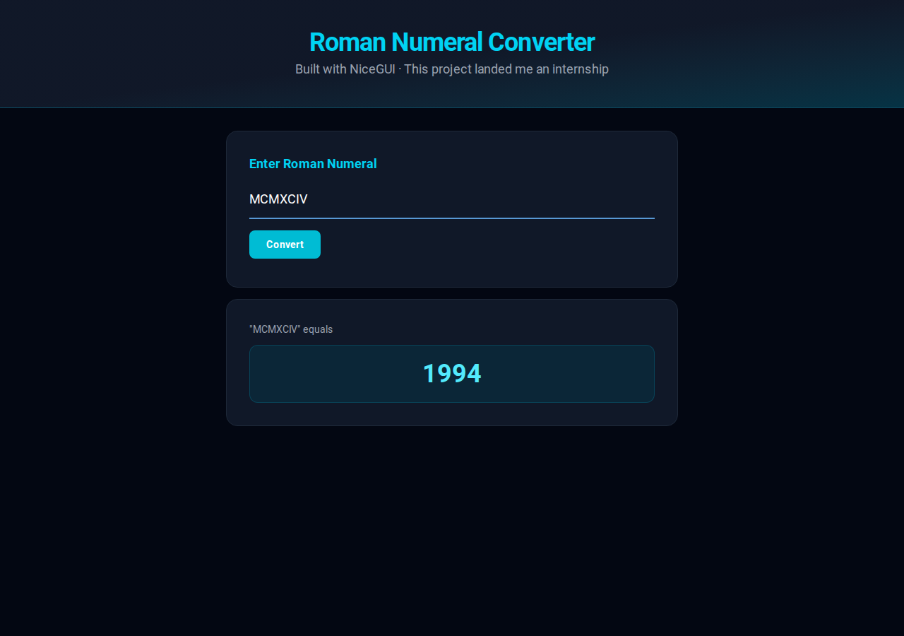

# Roman Numeral Converter

A simple web app that converts Roman numerals to Arabic numerals, built with [NiceGUI](https://nicegui.io/).



## The Story

This project is special — I shipped it so fast with NiceGUI that it **landed me an internship**. Sometimes the best projects are the simplest ones.

## Features

- Convert Roman numerals to Arabic numerals
- Error handling for invalid input and characters
- Clean, responsive UI

## Running Locally

```bash
pip install -r requirements.txt
python main.py
```

Then open http://localhost:8080

## Docker

```bash
docker-compose up
```

## Live

https://roman-numeral.evnchn.io/
